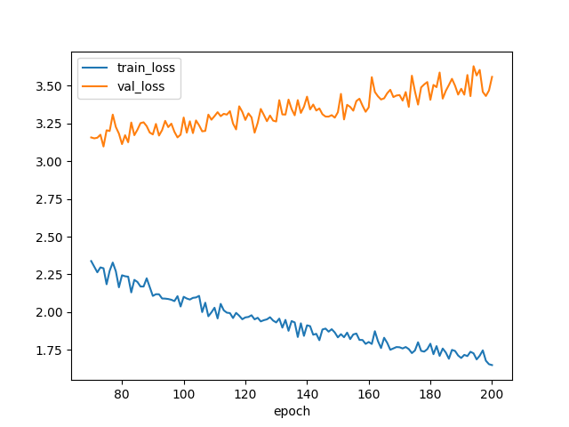

This is forked from https://github.com/TencentARC/UMT

# Goal

In this project, we want to train a video highlight detection model to extract compelling short-form videos from long-form videos.

# What We Have Done

We introduce our dataset type, so that we can train new model based on UMT model framework. The training loss is as the below figure, from which we can see that the training is overfitting after 70 epochs. The training result will be stored in `work_dirs/umt_base_200e_qvhighlights_1`.



# How to

1. Prepare video feature use CLIP model.
    - Extract image features using the [infer_dataset.py](https://github.com/hotstar/media_understanding_univtg/blob/master/infer_dataset.py).
3. Prepare audio feature:
    1. Extrace audio features:
        1. You may need to unify the name and format of audio files first using `audio/unify_audio_name.sh`.
        2. Then we can extract embedding vector using `audio/extract_audio_feature.sh`, which relies on `audio/extract_audio_feature.py` and famous library `panns_inference`.
    2. Use `process_feature_and_label.py` to copy features and create labels (rating > 3 as positive sample, otherwise it is negative).
4. Run `./run.sh` using local GPU
    - or Run `sync_efs.sh` to copy files to shared file system and run `run_slurm.sh` on remote GPUs.
    - The model is small and single GPU should be enough.

# Code Structure

1. This code take fully usage of [nncore](https://github.com/yeliudev/nncore).
2. Configs are represented as python native `dict`.
3. Datasets class will be loaded by `configs/_base_/datasets/qvhighlights.py`
4. From high level, model structure (forward function) is implemented in ./models/model.py

## Our Implementation

Most code we createe in this project is [the implementation of a new dataset](./datasets/hotstar_highlight_865.py) for Hotstar.

In addition, we have created [an entry configuration](datasets/hotstar_highlight_865.py) to load hyperparameters and [a sub configuration for train/validation dataset split](configs/_base_/datasets/hotstar_highlight_865.py)

## Data Format

This project support various types of format. We follow `QVHighlight` for our training, whose dimension is shown as the below:

```
[Visual] clip feature: (75, 512)
[Text] clip subtitle:
    last_hidden_state: (9, 512)
    pooler_output: (512,)
[Audio] panns_feature: (75, 2048)
```
